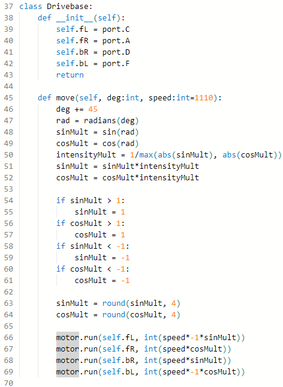

# Robotics Journal

# Week 2

## Disclaimer!

The previous 2 terms of work were undocumented, as it consisted mostly of recreating the work we had done last year. The main things our group finished were:

- Designing + building robots
- Some basic code to move the bot, etc.

## Progress

We were able to focus in today on working on the code for Spike Prime. First, we reformatted the code we had to utilise classes for readability, and grouping functions together with devices. For example, we created a `Drivebase` class that was responsible for handling motor interactions, such as a `move(degrees)` function. 

This makes the main code overall much easier to read.

We also attempted to write and read config files, so that minor adjustments could be made more easily on the day of a competition. We attempted simply using `open("file.txt" ...)` and `read("file.txt")`, but we kept getting an error saying that the file did not exist when we attempted to read

To test if the files were actually being created, we used `os.listdir()`. After playing around a bit, we figured that while the files were being created, they were being deleted after the script finished running.

We later discovered, using `os.listdir("../")` to find the parent folder and `os.listdir("../../")`to find the root folder, that the scripts were run in isolated environments that would be reset after the script finished.

To fix this, we realised that we could read and write to the root directory, as files there were not reset in between script executions. From this, we developed a class to write/read JSON files for configuration.

